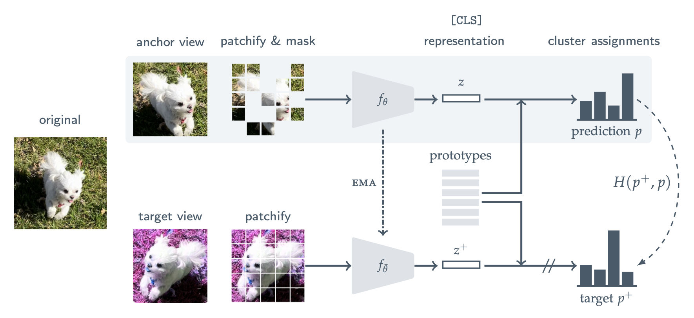

<!-- 
_class: lead invert
_paginate: skip
 -->

# Masked Siamese Network for Audio

**Piotr Hondra**

---

# Opis metody

1. MSN w obrazkach 
2. Dostosowanie do Audio
3. Preprocesing
4. Augementacje

---
<!-- header: Opis metody | Piotr Hondra | MSN w Audio --> 
<!-- _footer:  Assran, Mahmoud, et al. "Masked siamese networks for label-efficient learning." European Conference on Computer Vision. Cham: Springer Nature Switzerland, 2022.-->

# MSN w obrazkach

<!-- Masked Sieamese Networks polega na użyciu losowych augmentacji danych, aby wygenerować dwa widoki obrazu, zwane widokiem zakotwiczonym (ang. anchor view) i widokiem docelowym (ang. target view). Następnie na widok zakotwiczony zostaje nałożona losowa maska, podczas gdy widok docelowy pozostaje niezmieniony. Celem jest przypisanie reprezentacji widoku zakotwiczonego z maską do tych samych klastrów co reprezentacja widoku docelowego bez maski. Standardowa strata entropii krzyżowej jest używana jako kryterium optymalizacji. -->

---

# Dostosowanie do Audio

<!-- Tak jak w artykule skorzystano z pretrenowanego transformera ViT `vit_b_32` z torchvision. Dodano na początku w bloku projekcji, warstwę konwolucyjną celem przekształcenia jednokanałowego audio na trzykanałowy pseudo obraz wymagany przez ViT. -->

---

# Preprocesing

Skorzystano ze zbioru AudioSet

- częstotliwość próbkowania: 16 kHz
- n_fft: 1024
- win_length: 1024
- hop_length: 160
- n_mels: 64
- f_min: 60 Hz
- f_max: 7 800 Hz

<!-- Dane dźwiękowe zostały poddane przekształceniu w logarytmiczną skalę mel-spektrogramu przy użyciu określonych parametrów. Fragmenty dźwiękowe zostały przetworzone przy standaryzowanej częstotliwości próbkowania wynoszącej 16 000 Hz. W celu skonstruowania mel-spektrogramu przeprowadzono analizę FFT (Fast Fourier Transform) przy użyciu wartości n_fft (liczba punktów w każdym FFT) równą 1024. Wielkość okna, zastosowana do sygnału dźwiękowego, miała długość 1024 próbek (win_length), a ramki były próbkowane w odstępach 160 próbek (hop_length).

Mel-spektrogram został skonfigurowany z 64 mel-przestrzennymi binami częstotliwości (n_mels), obejmującymi zakres częstotliwości od 60 do 7 800 Hz. Zapewniło to, że spektrogram był czuły na częstotliwości istotne dla analizy dźwięku. Wybór f_min (minimalna częstotliwość) równego 60 i f_max (maksymalna częstotliwość) równego 7800 określił granice filtrów mel, podkreślając istotny z punktu widzenia percepcji zakres częstotliwości. -->

---
# Augementacje

- `MixupBYOLA` 20%
- `RandomLinearFader`
- `Random Resized Crop`
  - target: 224
  - focal: 96
- `RunningNorm`

<!-- Proces augmentacji dźwięku obejmuje sekwencję transformacji stosowanych do danych wejściowych audio w celu wzmocnienia zdolności modelu do nauki i poprawy ogólnej generalizacji. Szczegółowe zastosowane transformacje obejmują:

Transformacja `MixupBYOLA` z 20% prawdopodobieństwem zastosowania oraz włączonym logarytmicznym rozszerzeniem mixup (log_mixup_exp=True). Ta technika miesza dwa próbkowane dźwięki, tworząc nową, rozszerzoną próbkę, co przyczynia się do zdolności modelu do nauki bardziej stabilnych reprezentacji.

Dodatkowo stosowana jest transformacja `RandomLinearFader`. Wprowadza ona losowy efekt liniowego zaniku dźwięku, działając jako dynamiczna zmiana głośności w czasie.

Transformacja `Random Resized Crop` dalej zróżnicowuje dane poprzez losowe przycinanie i zmianę rozmiaru dźwięku do określonego rozmiaru (crop_size 224) oraz losowego współczynnika skali w określonym zakresie (crop_scale między 0.3 a 1.0). Antyaliasing jest wyłączony podczas tego procesu.

Na koniec, transformacja `RunningNorm` stosuje normalizację biegnącą do danych audio. Statystyki normalizacji są obliczane na podstawie określonej liczby próbek na epokę (epoch_samples 10). Normalizacja `RunningNorm` pomaga utrzymać stabilną średnią i odchylenie standardowe podczas treningu, przyczyniając się do zwiększenia stabilności modelu i zbieżności.

Ogólnie rzecz biorąc, te transformacje mają na celu stworzenie rozszerzonych wersji danych wejściowych audio, poprawiając odporność modelu i jego zdolność do generalizacji do różnorodnych sygnałów dźwiękowych, co jest zasadniczą częścią uczenia SSL. -->

---

# Setup

- epoki: 500
- lr: 1e-4
- `MultiStepLR` z kamieniami milowymi co 100 epok i gamma 0.1

<!-- Setup obejmował trening modelu przez 500 epok. Proces optymalizacji był prowadzony przy użyciu współczynnika uczenia (lr) równego 1e-4, co zapewniało pożądany  balans między szybkością zbieżności a stabilnością. W celu dalszego dostrojenia harmonogramu współczynnika uczenia, wprowadzono krokowe dostosowania (`MultiStepLR`). W szczególności, użyto kamienie milowe ustawione na epokach 100, 200, 300 i 400. Przy każdym kamieniu milowym wartość współczynnika uczenia była mnożona przez czynnik (gamma) równy 0.1. -->

---
<!-- header: Piotr Hondra | MSN w Audio -->
# Ewaluacja i Wyniki

---
# Ewaluacja i Wyniki

W celu oceny wydajności modelu przeprowadzono ewaluację przy użyciu repozytorium [eval-audio-repr](https://github.com/nttcslab/eval-audio-repr), wykorzystując w szczególności technikę próbkowania liniowego (linear probing).

<!-- Należy zauważyć, że z powodu użycia modelu Vision Transformer (ViT), konieczne było dodanie zero-padding, co potencjalnie może wpłynąć na ogólną wydajność modelu.

Poniżej przedstawione są uzyskane wyniki: -->
 
 

| Dataset | Byol-A Acc | MSN Acc [\%] (ours) |
| :-----: | :--------: | :-----------------: |
|  GTZAN  |  **64.1**  |        63.80        |
| NSynth  |    72.5    |      **72.51**      |
| ESC-50  |  **79.7**  |        71.5         |

---

# Wnioski i dyskusja

---
# Wnioski i dyskusja

- blisko SOTA
- wycinanie i skalowanie do 224 oraz 96
- inna konfiguracja  augmentacji oraz hiperparametrów
- ewaluacja z padding-zero 

<!-- Uzyskane rezultaty nie ustanawiają SOTA, jednak znajdują się blisko pożądanych wyników. Myślę, że jest wiele elementów, które można by zmienić by ostatecznie rzetelnie ocenić MSN w użyciu do Audio.

Po pierwsze użyto ViT, który nie dzielił na patche bez części wspólnej. Co więcej, obrazki spektogramy zostały przycinane i skalowane do rozmiarów 224 dla `target_view` oraz 96 dla `focal_view`. Myślę, że warto poeksperymentować z patchowaniem, bardziej oddającym istotę spektogramów np. poprzez skupieniu się na konkretnych pasmach częstotliwości.

Po drugie warto by sprawdzić szersze spektrum augmentacji oraz ich hiperparametrów.

Ostatecznie, sama ewaluacja nie była pozbawiona błędów. Aby uzyskać odpowiednie patche należało dodać padding zero, który mógł wpłynąć na ogólną jakość sieci.

Podsumowując, metoda działa zaskakująco dobrze jak na warunki, które jej towarzyszyły. Nie wątpliwie wymaga ona dalszej analizy. -->